# Sample user: Sam, first week with Trakabl

Walked on 26 Sep 2026 (a Saturday) on the real app, signed in as the burner, Chromium at 390x844. Sam is 34, on
TRT from a clinic (Testosterone Cypionate, 125 mg on Monday and Thursday) and runs two peptides (BPC-157 daily,
Ipamorelin at night). He has used the app for a week. His thoughts are in his own voice; my notes are in brackets.

[Before the walk I cleared the burner to Sam's three compounds through the app's own Delete. The account had old
history, so the first-run bubble and the "First Dose Logged" pop-up could not show; those were checked on their
own in phase 2. Migration 026 is not applied, which shapes step 4.]

## 1. Adding TRT

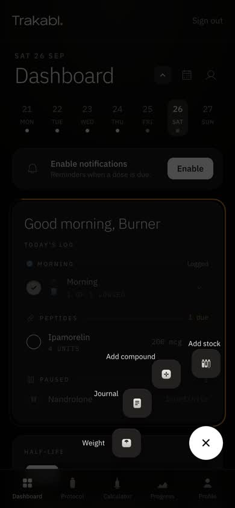 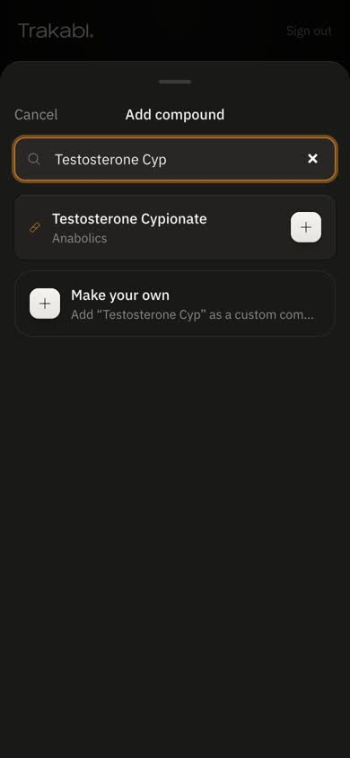 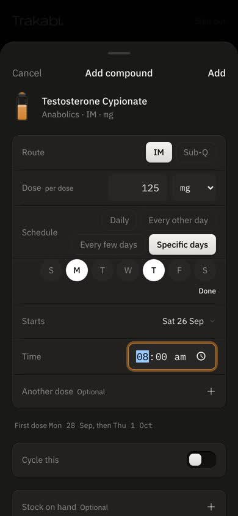

- "The + was obvious. Four things, I pressed Add compound, typed 'Testosterone Cyp' and there it was."
- "The time said 5:27 am. That's just now; I inject at 8. I had to change it."
- "'Every few days'? Every how many? I picked Specific days instead, Monday and Thursday."
- "It told me 'Pick at least one day.' when I forgot. Fair."
- [The day buttons are read out as "Toggle day 0" to "Toggle day 6": a screen reader user hears numbers, not days.]

## 2. Logging today's dose

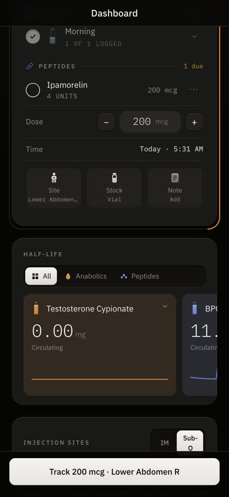

- "I injected TRT this morning but it's not on today's list, because I set Monday and Thursday. Where do I log it?"
  [Only a one-off can take it. Logging on another day is out of scope for this build.]
- "Ipamorelin was easy: tap it, tap Site, tap my stomach on the body, the big button says 'Track 200 mcg · Lower
  Abdomen R'. Done."

## 3. The half-life card

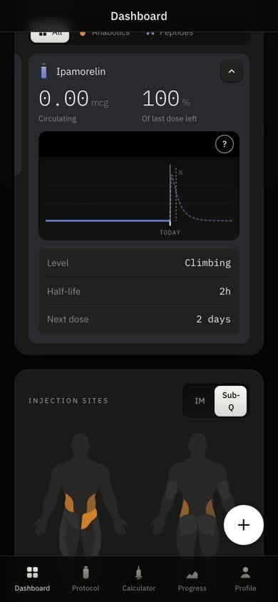

- "I just injected 200 mcg and it says 0.00 mcg circulating, 100% of last dose left. So is it in me or not?"
  [True to the model: absorption has not started. But it reads like the log did nothing.]
- "Testosterone shows '0.00 mg' before I've even taken one. I'd rather it said nothing yet."

## 4. Adding and mixing BPC-157

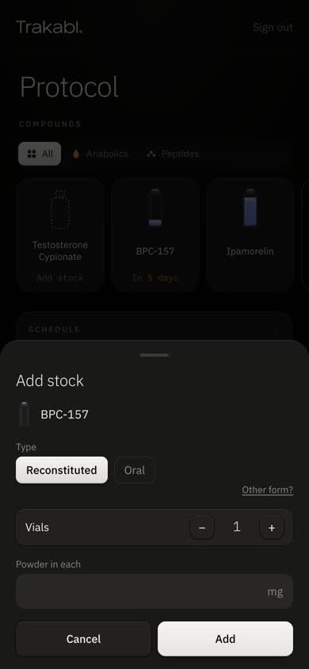 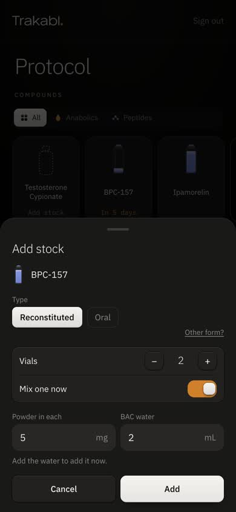 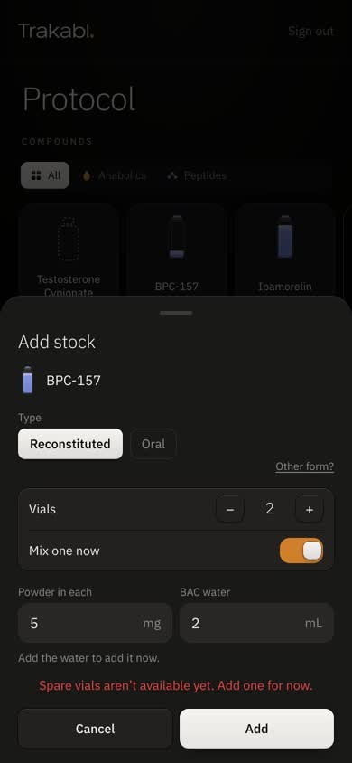 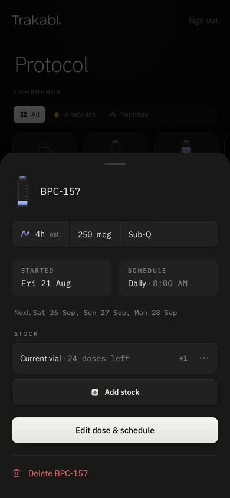

- "'Reconstituted'? I haven't mixed it yet, it's powder. I nearly picked the other one."
- "I pressed Add and it asked me for water. I'll add water when I mix it, not now." [The pre-026 fallback: the live
  database refuses an unmixed vial, so the sheet mixes one on the spot.]
- "I bought two vials. It said 'Spare vials aren't available yet. Add one for now.' Why can't I add both?"
  [Also pre-026. Both go away once 026 is applied.]
- "'Added 1 to BPC-157.' with Undo, good. But now the vial says 24 doses left, and the card outside still says it
  runs dry in 5 days. Which is it?" [A real inconsistency between the sheet's count and the card's runway.]

## 5. Pausing Ipamorelin

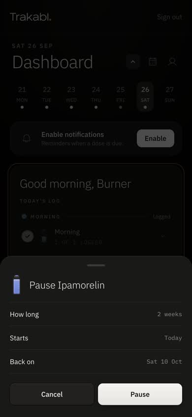 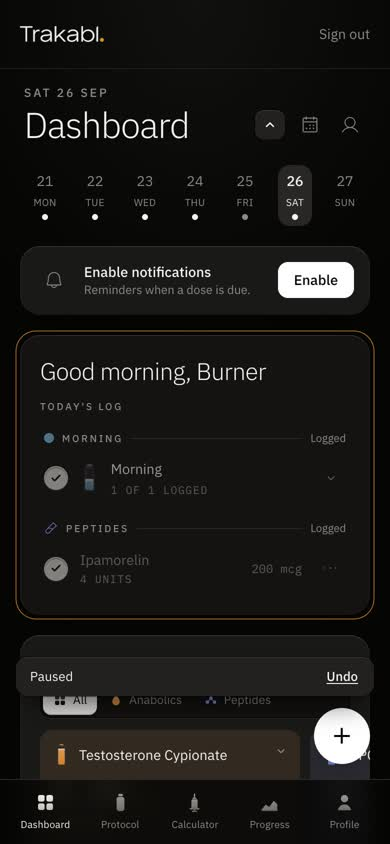

- "The dots on the row, Pause, two weeks, back on 10 Oct, Pause. 'Paused' with Undo at the bottom. Clear."
- "Today's dose is still ticked. Good, I did take it."

## 6. A cycle: add, end, delete

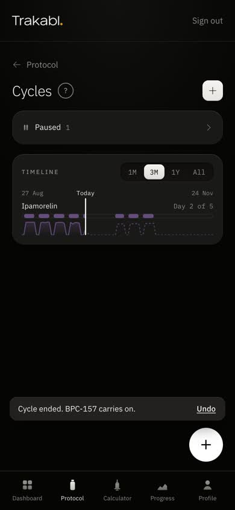 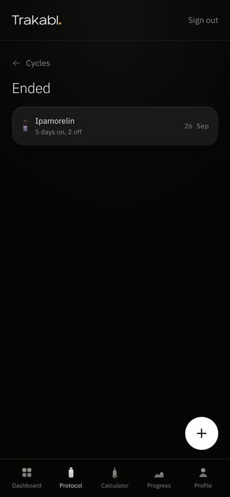 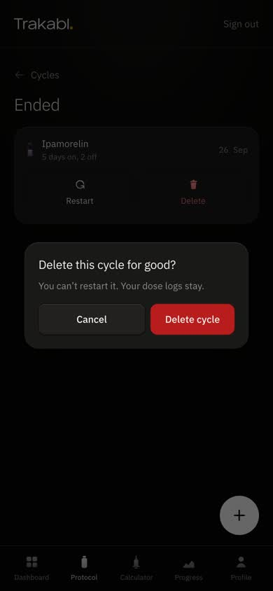

- "New cycle listed only the two without one. The sheet started on 'Continuous', which isn't really a cycle, so I
  switched to On / off, 7 and 7."
- "The dates are the phone's own date boxes (26/09/2026), not like the rest of the app."
- "End asked me properly: BPC-157 keeps going daily without weeks off. 'Cycle ended. BPC-157 carries on.' Good."
- "But the BPC-157 cycle I'd just made didn't show under Ended." [A cycle started and ended on the same day leaves no
  history: today's end replaces today's start, so it vanishes rather than moving to Ended.]
- "Ending Ipamorelin's older cycle did put it under Ended, with the date. Restart and Delete are right there. Delete
  asked once and the dose logs stay. 'Cycle deleted' with Undo."

## 7. A progress photo

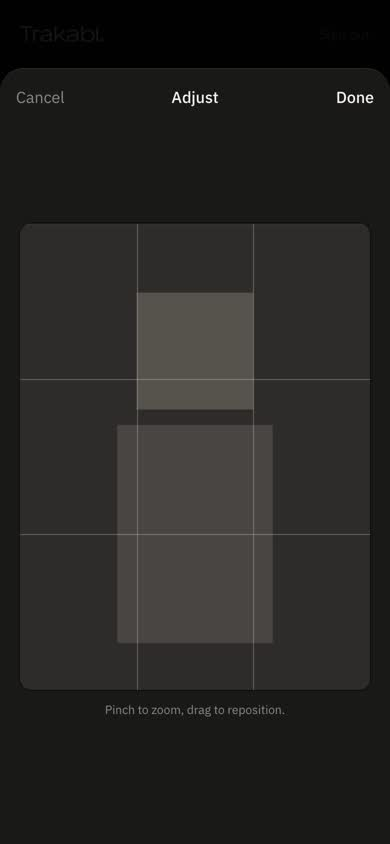 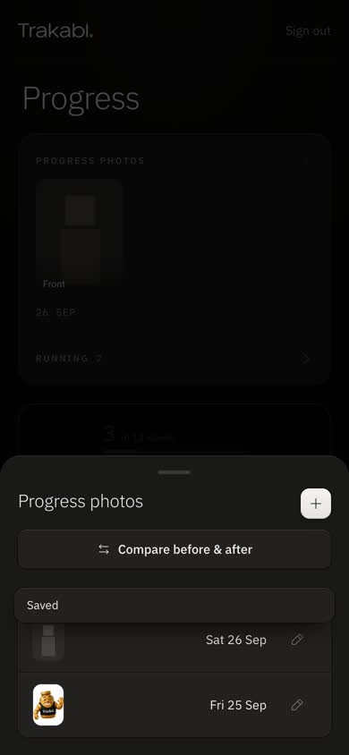 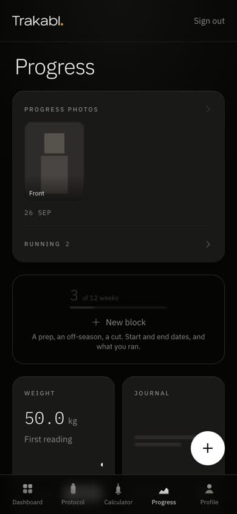

- "Photos, the +, tap Front, pick the photo, drag it, Done, Save. 'Saved.' It's on the card with the date."
- "The adjust screen said the same hint twice."

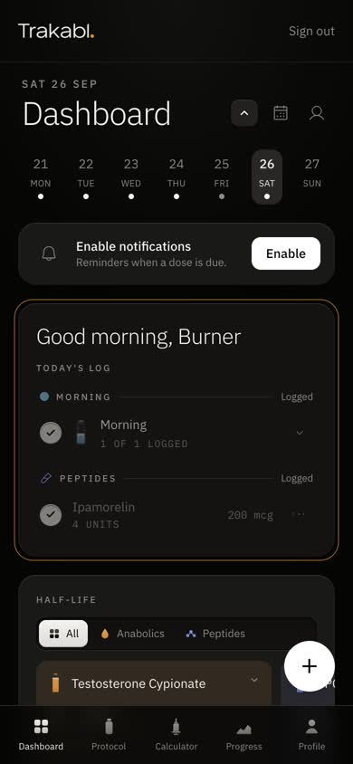

## What Sam would tell you

1. It is simple where it matters: logging is two taps and a map, and every change says so at the bottom with Undo.
2. Three moments made him stop: the dose he took on a day it wasn't scheduled, the 0.00 right after injecting, and
   the stock numbers that disagree (24 doses left, runs dry in 5 days).
3. Words he didn't get: "Reconstituted" for a powder he hasn't mixed, "Every few days", "Continuous" as a kind of
   cycle.
4. Stock needs migration 026 to feel right: no water up front, and more than one vial at a time.
